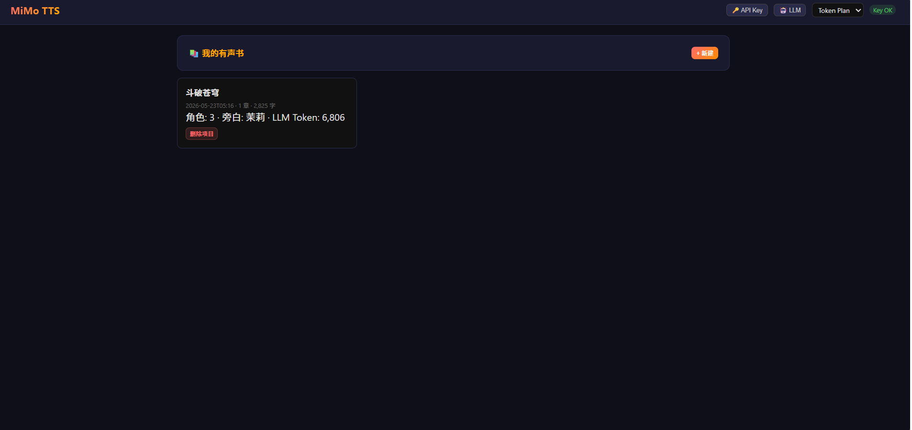
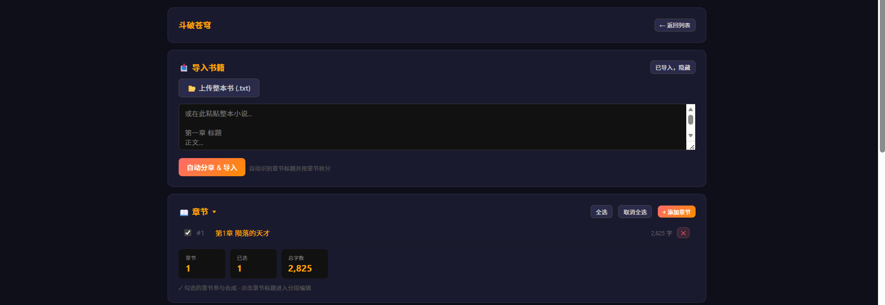
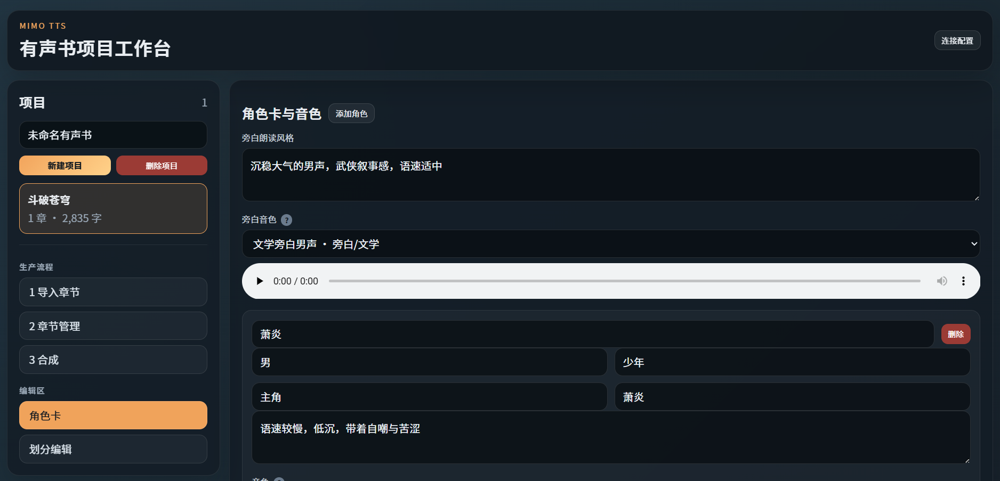
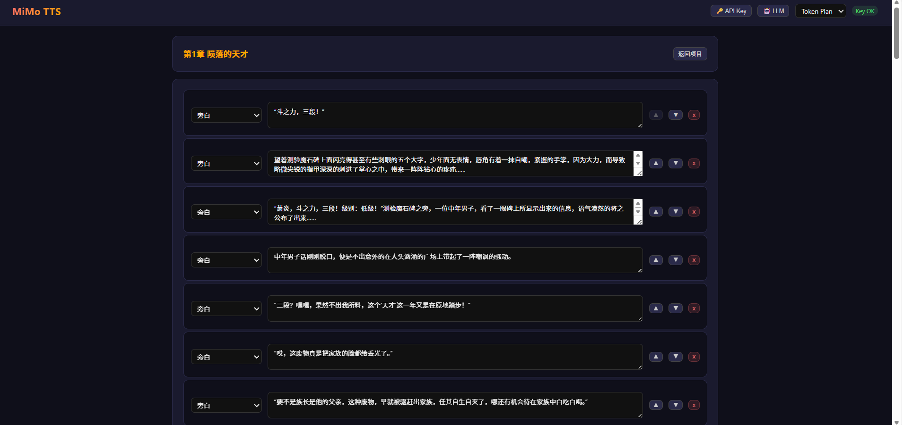
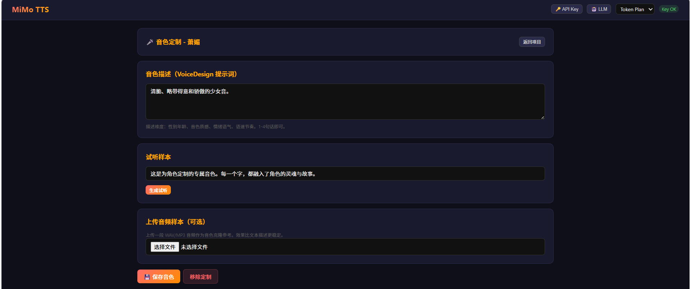
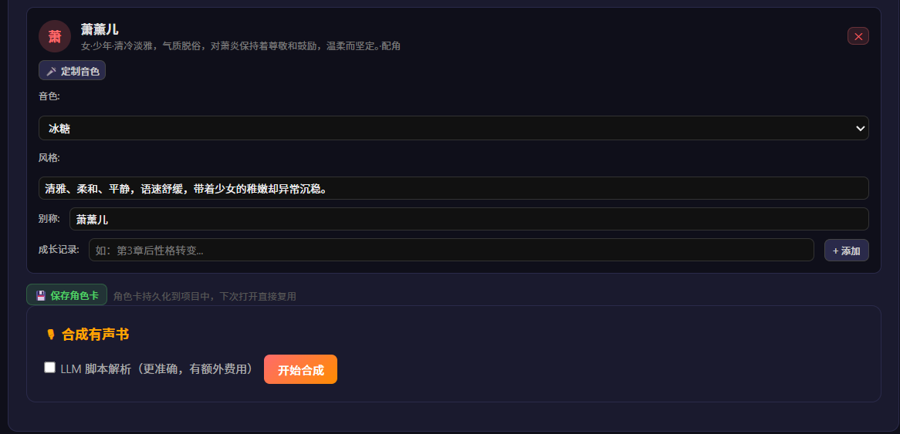

# MiMo TTS — AI 有声书制作工具

基于 [小米 MiMo API](https://platform.xiaomimimo.com?ref=V25WQB) 的 AI 有声书制作工具。上传小说 → 自动分章 → LLM 识别角色 → 定制音色 → 多角色对话有声书。

## 效果展示

第1章 陨落的天才 — 4 角色多声线配音（试听片段）

[🎧 点击下载试听](https://raw.githubusercontent.com/dqsq2e2/mimo-tts/master/static/demo.wav)

## 界面预览













## 功能特性

| 功能 | 说明 |
| ---- | ---- |
| 📥 整书导入 | 上传 .txt 自动检测章节标题并按章节拆分 |
| 🎭 角色识别 | LLM 双阶段分析：先提取全部角色（含别称），再逐章划分对话 |
| 🎤 音色定制 | VoiceDesign 文字描述生成专属音色，上传音频克隆到 VoiceClone |
| 🔀 角色别称 | LLM 自动识别 + 手动编辑，支持全名/简称/身份/关系/指代 |
| 🎙 多角色配音 | 预置 4 中文音色 + 4 英文音色 + 定制音色，每个角色不同声音 |
| 📖 分章节管理 | 逐章导入/删除、勾选识别/合成、按章独立输出 WAV |
| ✏️ 分段编辑 | 点击章节进入编辑，下拉选角、▲▼排序、增删分段 |
| 💾 角色卡持久化 | 以书籍为单位建档，增量更新角色卡，支持成长记录 |
| 🤖 LLM 独立配置 | 可自定义 LLM 端点/Key/模型，与 TTS 分离 |
| 🔄 双端点 | 按量付费 / Token Plan 一键切换，浏览器记忆 |
| 📊 LLM Token 统计 | 仅统计 LLM（TTS 免费不计），项目卡片可见 |
| 🛡 零隐藏费用 | 不勾选绝不调用 LLM，JSON 模式 + 自动修复保证输出质量 |

## 快速开始

### 1. 注册获取 Key

[platform.xiaomimimo.com](https://platform.xiaomimimo.com?ref=V25WQB) → 控制台 → API Keys

### 2. 安装启动

```bash
pip install -r requirements.txt
python app.py
# http://localhost:5000
```

### 3. Docker 部署

**从源码构建：**

```bash
MIMO_TOKEN_PLAN_KEY=你的Key docker compose up -d
```

**拉取镜像运行：**

```yaml
# docker-compose.yml
services:
  mimo-tts:
    image: dqsq2e2/mimo-tts:latest
    container_name: mimo-tts
    ports:
      - "5000:5000"
    environment:
      - MIMO_TOKEN_PLAN_KEY=${MIMO_TOKEN_PLAN_KEY}
    volumes:
      - ./projects:/app/projects
      - ./static:/app/static
    restart: unless-stopped
```

### 4. 配置

右上角「🔑 API Key」→ 输入 Key。可选「🤖 LLM」自定义 LLM 配置。

环境变量方式：

```bash
set MIMO_API_KEY=你的Key         # 按量付费
set MIMO_TOKEN_PLAN_KEY=你的Key  # Token Plan
```

### 5. 制作有声书

1. 新建项目 → 输入书名
2. 导入 .txt → 自动分章
3. 勾选章节 → 点击「识别角色」→ LLM 建立角色卡 + 划分对话
4. 调整音色/别称/旁白 → 可选「🎤 定制音色」
5. 开始合成 → 按章下载

## 超长书处理

增量批处理，自适应上下文（`mimo-v2.5` 1M 上下文，`mimo-v2-flash` 256K）：

| 阶段 | 每批 | 说明 |
|------|:---:|------|
| 角色提取 | 40 章（12 万字） | 输出小，一次大量 |
| 逐章划分 | 1 章 | 输出含完整分段，独立处理 |

跳过已处理章节（`_parsed_done`），支持强制重新识别。

## LLM 调用规则

| 操作 | LLM | 费用 |
|------|:---:|------|
| 识别角色 | ✅ 分批 | ¥0.01~0.10/书 |
| 识别 + LLM 划分 | ✅ 双阶段 | ¥0.50~1.50/书 |
| 合成（有缓存） | — | 免费 |
| 合成（无缓存） | — | 纯正则，免费 |
| 音色定制 | ✅ | VoiceDesign/VoiceClone 限免 |

> TTS / VoiceDesign / VoiceClone 当前**限时免费**。不勾选 LLM 绝不会自动调用。

## 提示词工程

双 Prompt 体系，统一风格，均含铁律/优先级/示例/负例：

| Prompt | 用途 | 核心规则 |
| ------ | ---- | -------- |
| CHARACTER_DETECT | 识别角色 + 别称 | 5 级优先级、去重合并、错误示例 |
| SCRIPT_PARSE | 划分对话片段 | 6 级说话人判定、特殊引号分析、原文零丢失 |

JSON 输出采用 `response_format={"type": "json_object"}` 强制模式 + 自动修复函数兜底。

## 音色

| 音色 | 性别 | 适用 |
| ---- | :---: | ---- |
| 冰糖 | 女 | 少女、青年 |
| 茉莉 | 女 | 成熟、知性 |
| 苏打 | 男 | 少年、青年 |
| 白桦 | 男 | 沉稳中年 |
| 定制 | — | VoiceDesign 生成 / 音频克隆 |

## 项目结构

```text
mimo-tts-main/
├── app.py                     # Flask Web 界面
├── main.py                    # CLI
├── requirements.txt
├── static/                    # 按书名分文件夹
└── tts_audiobook/
    ├── config.py              # 模型、音色、定价
    ├── text_chunker.py        # 分块 + 章节检测
    ├── mimo_client.py         # TTS API 客户端
    ├── character_detector.py  # LLM 角色识别 + 别称 + 音色
    ├── script_parser.py       # 正则 + LLM 对话解析
    ├── audio_merger.py        # WAV 拼接
    └── cost_tracker.py        # 成本追踪
```

数据存储：

```text
projects/{id}/
├── project.json              # 书名、角色卡、llm_tokens
├── chapters/                 # 每章独立 JSON
└── voice_samples/            # 定制音色 WAV
```

## License

MIT — [LICENSE](LICENSE)
