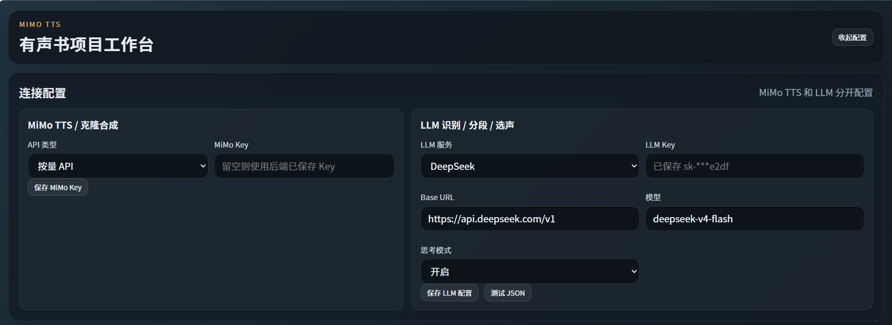
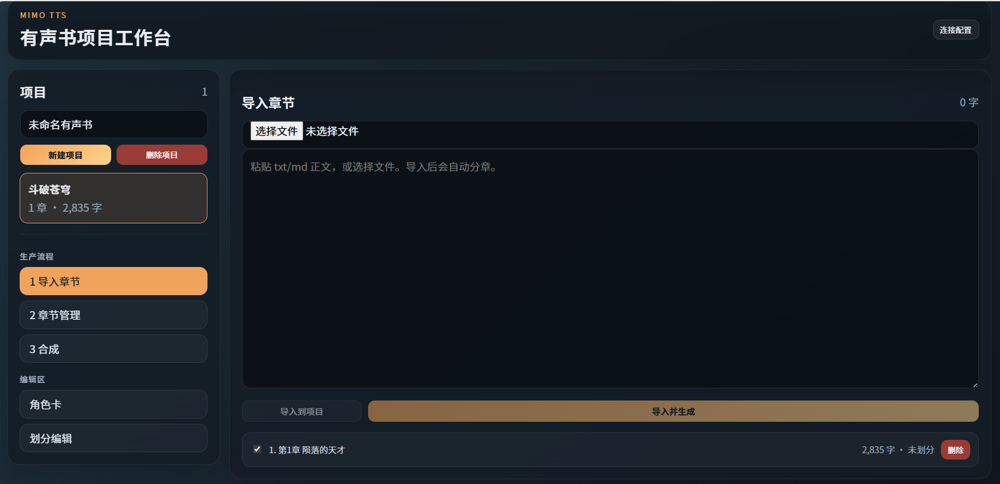
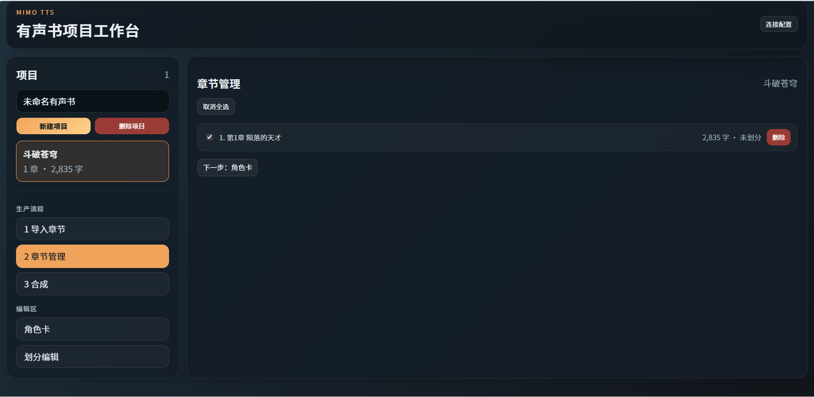
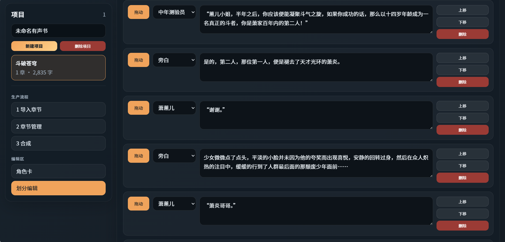

# MiMo TTS — AI 有声书制作工具

基于 [小米 MiMo API](https://platform.xiaomimimo.com?ref=V25WQB) 的 AI 有声书制作工具。上传小说 → 自动分章 → LLM 识别角色 → 选择音色 → 多角色对话有声书。

## 界面预览











## 功能特性

| 功能 | 说明 |
| ---- | ---- |
| 📥 整书导入 | 上传 .txt 自动检测章节标题并按章节拆分 |
| 🎭 角色识别 | LLM 多批次增量分析：识别角色、别称、性格、说话风格 |
| 🎤 克隆音色 | 50 款精选音色库，LLM 按性别/年龄/风格自动匹配，音频试听 |
| 🎙 预置音色 | 冰糖 / 茉莉 / 苏打 / 白桦 4 款 MiMo 预置音色可选 |
| 🎛 风格控制 | 克隆+预置双路径均支持自然语言风格描述和音频标签 |
| 📖 分章节合成 | 按章节独立输出 WAV，文件名 `书名_章节名.wav` |
| ✏️ 分段编辑 | 逐章查看/编辑分段，拖拽排序、下拉选角、增删分段 |
| 💾 角色卡持久化 | 以项目为单位建档，增量更新角色卡和音色分配 |
| 🤖 LLM 独立配置 | 自定义 LLM 端点/Key/模型/思考模式，与 TTS 分离 |
| 🔄 双端点 | 按量付费 / Token Plan 一键切换 |
| 📊 Token 统计 | 实时显示 LLM token 消耗和成本估算 |
| 🛡 任务持久化 | 刷新页面不丢进度，自动恢复合成任务轮询 |

## 快速开始

### 1. 注册获取 Key

[platform.xiaomimimo.com](https://platform.xiaomimimo.com?ref=V25WQB) → 控制台 → API Keys

### 2. 安装启动

```bash
# 后端
pip install -r requirements.txt
python app.py

# 前端开发
cd frontend && npm install && npm run dev
# http://localhost:5173
```

生产模式：
```bash
cd frontend && npm install && npm run build
python app.py
# http://localhost:5000
```

### 3. Docker 部署

#### 方式 A：从本地源码构建（使用仓库自带 docker-compose.yml）

```bash
git clone https://github.com/dqsq2e2/mimo-tts.git
cd mimo-tts

# 可选：提前创建持久化目录
mkdir -p .runtime projects static

# 使用当前源码构建镜像并启动
docker compose up -d --build
# http://localhost:5000
```

仓库自带的 `docker-compose.yml` 会从本地 `Dockerfile` 构建镜像，适合二次开发或本地修改后运行。

#### 方式 B：直接拉取镜像运行（命令行）

```bash
docker pull dqsq2e2/mimo-tts:latest

docker run -d \
  --name mimo-tts \
  -p 5000:5000 \
  -e MIMO_TOKEN_PLAN_KEY=你的TokenPlanKey \
  -e LLM_PROVIDER=deepseek \
  -e LLM_API_KEY=你的LLMKey \
  -e LLM_BASE_URL=https://api.deepseek.com/v1 \
  -e LLM_MODEL=deepseek-v4-flash \
  -e LLM_THINKING=enabled \
  -v "$(pwd)/.runtime:/app/.runtime" \
  -v "$(pwd)/projects:/app/projects" \
  -v "$(pwd)/static:/app/static" \
  dqsq2e2/mimo-tts:latest
```

#### 方式 C：直接拉取镜像运行（docker-compose.yml）

```yaml
services:
  mimo-tts:
    image: dqsq2e2/mimo-tts:latest
    container_name: mimo-tts
    ports:
      - "5000:5000"
    environment:
      - FLASK_HOST=0.0.0.0
      - FLASK_PORT=5000
      - MIMO_API_KEY=${MIMO_API_KEY:-}
      - MIMO_TOKEN_PLAN_KEY=${MIMO_TOKEN_PLAN_KEY:-}
      - LLM_PROVIDER=${LLM_PROVIDER:-deepseek}
      - LLM_API_KEY=${LLM_API_KEY:-}
      - LLM_BASE_URL=${LLM_BASE_URL:-https://api.deepseek.com/v1}
      - LLM_MODEL=${LLM_MODEL:-deepseek-v4-flash}
      - LLM_THINKING=${LLM_THINKING:-enabled}
      - LLM_REASONING_EFFORT=${LLM_REASONING_EFFORT:-}
      - FLASK_DEBUG=${FLASK_DEBUG:-0}
    volumes:
      - ./.runtime:/app/.runtime
      - ./projects:/app/projects
      - ./static:/app/static
    restart: unless-stopped
```

```bash
docker compose up -d
# http://localhost:5000
```

| 环境变量 | 说明 |
|---------|------|
| `MIMO_TOKEN_PLAN_KEY` | Token Plan API Key |
| `MIMO_API_KEY` | 按量付费 API Key |
| `LLM_PROVIDER` | 可选，`deepseek` / `mimo` |
| `LLM_API_KEY` | 可选，LLM API Key |
| `LLM_BASE_URL` | 可选，LLM Base URL |
| `LLM_MODEL` | 可选，默认可在前端连接配置中保存 |
| `LLM_THINKING` | 可选，`enabled` / `disabled` |
| `LLM_REASONING_EFFORT` | 可选，思考强度 |
| `FLASK_DEBUG` | 调试模式（默认 0） |

| 挂载卷 | 说明 |
|--------|------|
| `./.runtime:/app/.runtime` | 后端保存的 Key 与 LLM 配置 |
| `./projects:/app/projects` | 项目数据持久化 |
| `./static:/app/static` | 合成音频输出 |

如果不想通过环境变量写 Key，也可以只挂载 `.runtime`，启动后在右上角「连接配置」里保存 MiMo Key 和 LLM 配置；这些内容只会写到后端挂载目录，不写浏览器存储。

### 4. 配置

右上角「连接配置」→ 填入 MiMo Key 和 LLM 配置。

环境变量方式：
```bash
set MIMO_API_KEY=你的Key         # 按量付费
set MIMO_TOKEN_PLAN_KEY=你的Key  # Token Plan
```

## 制作流程

1. **新建项目** → 输入书名
2. **导入 .txt** → 自动分章，默认全选
3. **章节管理** → 勾选/取消章节，全选/取消全选
4. **合成设置** → 选择是否提取角色、划分方式、音色库类型、批次长度
5. **开始合成** → 一键完成：角色识别 → 对话划分 → 音色分配 → 音频合成
6. **下载音频** → 按章节下载 WAV 文件

## 提示词工程

三 Prompt 体系，均含铁律/优先级/示例/负例：

| Prompt | 用途 | 核心规则 |
| ------ | ---- | -------- |
| CHARACTER_DETECT | 识别角色 + 别称 + 音色 | 5 级优先级、去重合并、50 款音色库匹配 |
| CHARACTER_DETECT_CONTINUE | 增量角色提取 | 传已有角色卡，LLM 补充新角色和别称 |
| SCRIPT_PARSE | 划分对话片段 | 6 级说话人判定、特殊引号分析、原文零丢失 |

JSON 输出采用 `response_format={"type": "json_object"}` 强制模式 + 自动修复函数兜底。

## 音色

| 类型 | 数量 | 说明 |
|------|:---:|------|
| 克隆音色 | 50 款 | IndexTTS 精选，覆盖男女老幼各年龄段和角色类型，可试听 |
| 预置音色 | 4 款 | 冰糖 / 茉莉 / 苏打 / 白桦，MiMo API 内置 |

## 项目结构

```text
mimo-tts-main/
├── app.py                     # Flask Web 服务
├── main.py                    # CLI 入口
├── requirements.txt
├── Dockerfile
├── docker-compose.yml
├── voices/                    # 克隆音色 WAV 文件（50 款）
├── static/                    # 合成音频输出 + 截图
├── projects/                  # 项目数据
├── frontend/                  # Vue 3 前端
│   ├── src/App.vue            # 单文件 UI
│   ├── src/styles.css         # 全局样式
│   └── dist/                  # 构建产物
└── tts_audiobook/
    ├── config.py              # 模型、音色、定价
    ├── text_chunker.py        # 分块 + 章节检测
    ├── mimo_client.py         # TTS API 客户端
    ├── character_detector.py  # LLM 角色识别 + 音色分配
    ├── script_parser.py       # 正则 + LLM 对话解析
    ├── voice_catalog.py       # 50 款克隆音色 + 4 款预置
    ├── workflow_runner.py     # 一键合成流水线
    ├── project_store.py       # 项目 CRUD
    ├── audio_merger.py        # WAV 拼接
    ├── cost_tracker.py        # 成本追踪
    └── llm_config.py          # LLM 配置管理
```

数据存储：
```text
projects/{id}/
├── project.json              # 书名、角色卡、音色分配、任务 ID
├── chapters/                 # 每章独立 JSON（原文 + 分段）
└── voices/                   # 项目级音色副本（运行时复制）
```

## License

MIT — [LICENSE](LICENSE)
